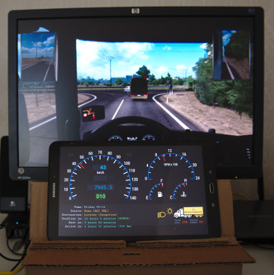
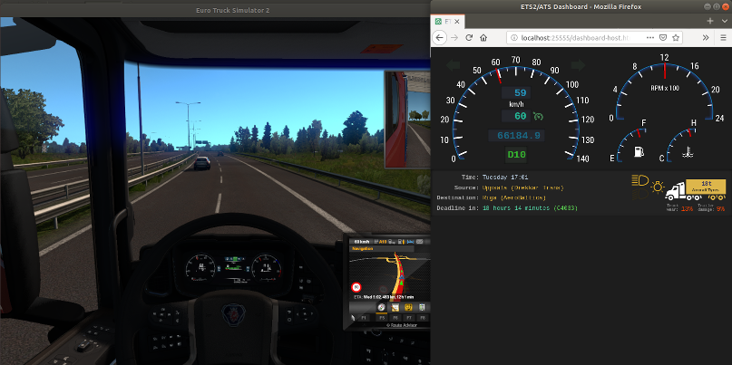

# pyets2_telemetry_server

forked and somewhat updated version of:
https://github.com/thomasa88/pyets2_telemetry_server

## Introduction

pyets2_telemetry_server provides a web dashboard for ETS2 ([Euro Truck Simulator 2](https://eurotrucksimulator2.com/)) in **Linux**, allowing the dashboard to be shown on a separate screen or phone/tablet.



The server is a full replacement for the server in [ETS2 Telemetry Web Server](https://github.com/Funbit/ets2-telemetry-server) (created by *Funbit*), which means that all [ETS2 Mobile Dashboard](https://github.com/Funbit/ets2-telemetry-server) skins can be used. In fact, the web code and the default set of skins is copied from ETS2 Telemetry Mobile Dashboard.

## Installation

First, install [pyets2_telemetry](https://github.com/thomasa88/pyets2_telemetry) for Python plug-in support.

Then, download the latest release archive (`.tar.bz2`) from the [release page](https://github.com/thomasa88/pyets2_telemetry_server/releases) and unpack it in the ETS2 `plugins` directory (typically `"$HOME/.steam/steam/steamapps/common/Euro Truck Simulator 2/bin/linux_x64/plugins"`).

The unpacked file structure should look similar to this:

```
Euro Truck Simulator 2
└── bin
    └── linux_x64
        └── plugins
            └── python
                └── pyets2_telemetry_server
                    ├── Html
                    ├── __init__.py
                    ├── LICENSE
                    ├── signalr
                    ├── version.py
                    └── web_server.py
```

After starting the game, the dashboard should be available at [http://localhost:25555]().



## Usage

pyets2_telemetry_server is used as follows:

1. Start the game.

2. From another device, navigate to `http://<COMPUTER-IP>:25555` in a web browser. You should see the dashboard selection screen.
3. Select a dashboard.
4. Truck!

### Hermit Lite App (Android)

[Hermit](https://play.google.com/store/apps/details?id=com.chimbori.hermitcrab) makes small Android "apps" from web pages. It can be used to create a dashboard app, as follows:

1. Install [Hermit Lite](https://play.google.com/store/apps/details?id=com.chimbori.hermitcrab) on your Android device.
2. Make sure that ETS2 is running on your computer.
3. Open Hermit, press *Create* at the bottom and then *Create Your Own* at the top.
4. Enter the URL `http://<COMPUTER-IP>:25555` (or the URL going directly to your favorite skin). The dashboard page should be shown.
5. Enter a name for the app and press *Create.*
6. Drag in the menu from the right and select *Frameless* and then *Full-screen*. Accept to restart the app.
7. Finally, open the base *Hermit* app again, find your app in the list, press *⋮* and *Add to Home Screen*.
8. Done!

## Compatibility

pyets2_telemetry_server has been tested with Euro Truck Simulator 2 version 1.50 on Arch, with Python 3.12.3.

## Performance

No apparent decrease of FPS has been observed, as compared to playing ETS2 without this plug-in.

## Client/Server Communication - SignalR

The client and server communicate using the [SignalR](https://dotnet.microsoft.com/apps/aspnet/real-time) protocol, sending objects encoded as JSON.

pyets2_telemetry_server implements a limited set of SignalR functionality, just enough to make the dashboard web client work. Only a simple version of the *Long Polling* transport is supported.

The dashboard protocol has the following function calls:

* client-to-server
  * `RequestData()` Server returns all telemetry data.
* server-to-client
  * `UpdateData()` Server sends all telemetry data.

### Client Tweaks

The original dashboard client, upon receiving data from `UpdateData()`, immediately calls `UpdateData()`, which results in the data being fetched twice every time. This call has been removed, as the client seems to work fine without it.

## Future Improvements

The following might need improvement in the future:

* If game performance is affected negatively,
  * change from using Python threads to Python multiprocessing (process fork) and/or
  * reduce data processing in the main thread.

* Add support for the dashboard `truck.user*` attributes, which provides information on current user control input.

* Support multiple clients correctly. Current server might miss to send data updates to all clients, when there are multiple clients.
* Avoid leaking client information upon client disconnection.
* Fix server name displayed on the menu page. (Currently displayed as `%SERVER%`).

## License

Refer to the [LICENSE](LICENSE) file.

